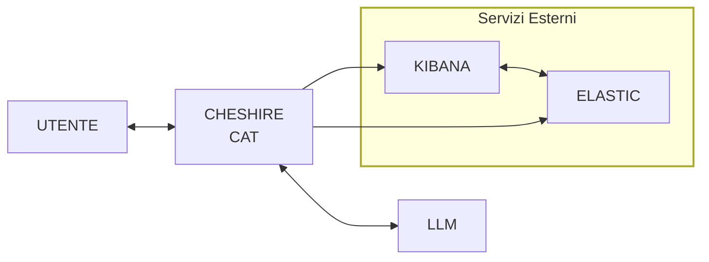

<p align="center">
  
</p>


<br>


![Cheshire Cat](https://img.shields.io/badge/Cheshire--Cat-5e4fa2.svg?style=for-the-badge&logo=data:image/svg+xml;base64,PHN2ZyB4bWxucz0iaHR0cDovL3d3dy53My5vcmcvMjAwMC9zdmciIHByZXNlcnZlQXNwZWN0UmF0aW89Im5vbmUiIHZpZXdCb3g9IjQzLjY1MiAzNi44NzkgMzA1Ljc0MiAyODkuODI4Ij48cGF0aCBkPSJtMzQ5LjM1OSAyMTUuNzI3LS4yNTQtNi4yNWMuMTI5LTE4LjA3NC0uNTc0LTEzMy41ODItMzkuODA1LTE2OC42NTItMS4yMTEtMi44NzEtNC4xNDUtNS4yNjItOS44ODctMy4xMjUtNS43MzggMi4xMDUtMzQuNTA4IDUzLjM0LTM5LjczOCA3Ni45OTYtMTkuMjMtNi4zNDgtNDAuNTM1LTkuODgzLTYzLjAyMy05Ljg4M3MtNDQuNjQ4IDMuNjk1LTY0LjE2OCAxMC4yNjZjLTYuNTA4LTI0LjU1MS0zMy42MTctNzIuNTMxLTM5LjEzNy03NC41NzQtNS43MzgtMi4xMzMtOC42NzIuMjU4LTkuODg3IDMuMTI1LTQyLjYwOSAzOC4wOTgtMzkuNzcgMTcxLjA0Ny0zOS43NyAxNzEuMDQ3LjA5NC0uMTI5LjE5MS0uMjU4LjI4NS0uNDE0IDAgLjUwOC0uMDYyLjk4OC0uMDYyIDEuNDY1IDAgNjEuMjc3IDY4LjM3OSAxMTAuOTggMTUyLjczOCAxMTAuOThzMTUyLjc0Mi00OS42NzIgMTUyLjc0Mi0xMTAuOTh6bS0xMjAuNDMtMjEuODRjMS43NTQtMS4wNTEgMy41NzQtMS43ODUgNS4yNjItMi45NjUgNC40MzQtMy4wMjcgNi41MDgtOS40NjkgNi40NDUtMTguODcxIDAtMy4wOTQtLjQxOC04LjkzLS4zODMtMTIuMDIgMC0zLjI4NSAxLjExMy01LjM1OSAyLjgwNS01LjU1MSAxLjcyMy0uMTkxIDMuMjg1IDEuNjYgNC4wNTEgNC45MS44NTkgMy42MzcgMS44ODMgMTAuMDc0IDIuODA5IDEzLjY0OCAyLjMyOCA4LjgyOCA2LjA1OSAxMy43NyAxMC45MzggMTUuMTc2IDEuNjYuNDc3IDMuMzE2Ljg1OSA0Ljk3NyAxLjQwMiAxLjg3OS42MDUgMy41Ny0uMDM1IDMuOTUzIDMuMzc5LjM1MiAzLjI4MS0xLjQzNCAzLjYwMi0zLjA2MiA0LjU1OS0xLjc4NSAxLjA1MS0zLjYzMyAxLjgxNi01LjM1NSAyLjk5Ni00LjI0MiAyLjkzNC02LjYwMiA2LjQxLTYuNjY4IDE1LjM2N2wuMDk4IDkuODJjMCAzLjQ0MS0xLjA4NiA1LjYwOS0yLjg3MSA1LjgwMS0xLjY2LjE2LTMuMTkxLTEuNTk0LTMuOTIyLTQuNjg3bC0yLjI2Ni0xMC4wMDhjLTIuNDI2LTkuOTgtNi4xNTYtMTIuNTYyLTExLjU3OC0xMy44MzYtMS40MzQtLjM1Mi0yLjg0LS43MDMtNC4yNzMtMS4xNDgtMS44NTItLjU3NC0zLjc2Mi0uNDgtNC4xNDUtMy44MjgtLjM4My0zLjMxNiAxLjUzMS0zLjEyNSAzLjE4OC00LjE0NXptLTE2LjkwMiA0Ny44ODdjLjMxNiAyLjU1MS0zLjkyNiA4LjQ4LTYuOTIyIDguODMyLTIuODQuMzUyLTcuNDk2LTQuNTU5LTcuODEyLTcuMDQ3LS4zMi0yLjYxMyAxNC40NzctNC4wNDcgMTQuNzM0LTEuNzg1bS04MC41LTM1LjM4N2MxLjc1NC0xLjA1NSAzLjU3LTEuNzg1IDUuMjYyLTIuOTY1IDQuNDM0LTMuMDMxIDYuNTA4LTkuNDY5IDYuNDQxLTE4Ljg3NSAwLTMuMDk0LS40MTQtOC45MjYtLjM4My0xMi4wMiAwLTMuMjg1IDEuMTE3LTUuMzU1IDIuODA5LTUuNTQ3IDEuNzIzLS4xOTEgMy4yODUgMS42NTYgNC4wNTEgNC45MS44NTkgMy42MzMgMS44NzkgMTAuMDc0IDIuODA1IDEzLjY0NSAyLjMyOCA4LjgzMiA2LjA2MyAxMy43NzMgMTAuOTQxIDE1LjE3NiAxLjY1Ni40NzcgMy4zMTYuODU5IDQuOTczIDEuNDAyIDEuODgzLjYwNSAzLjU3NC0uMDMxIDMuOTU3IDMuMzc5LjM1MiAzLjI4NS0xLjQzNyAzLjYwMi0zLjA2MiA0LjU1OS0xLjc4NSAxLjA1NS0zLjYzNyAxLjgxNi01LjM1OSAyLjk5Ni00LjI0MiAyLjkzNC02LjYwMiA2LjQxLTYuNjY0IDE1LjM2N2wuMDk0IDkuODJjMCAzLjQ0NS0xLjA4MiA1LjYxMy0yLjg2NyA1LjgwNS0xLjY2LjE1Ni0zLjE5MS0xLjU5NC0zLjkyNi00LjY4N2wtMi4yNjItMTAuMDEyYy0yLjQyNi05Ljk4LTYuMTU2LTEyLjU2Mi0xMS41NzgtMTMuODM2LTEuNDM3LS4zNTItMi44NC0uNzAzLTQuMjczLTEuMTQ4LTEuODUyLS41NzQtMy43NjYtLjQ3Ny00LjE0OC0zLjgyNC0uMzgzLTMuMzE2IDEuNTMxLTMuMTI1IDMuMTkxLTQuMTQ1ek0yMTMuMTQ1IDMxMEM5Ni42MDIgMzI0LjA1OSA3Mi4xNzIgMjQzLjA1MSA3Mi4wMTIgMjQyLjQ3N2MwLS4xMjktLjM1Mi0yLjk2NS0uNzM0LTYuMDkgMTUuNjYgMjQuMzU1IDQ2LjE1MiAzOC44MDEgNzAuMjk3IDQwLjcxMSAyMC44NTUgMS42NiA1Mi4xNDUtNi43ODkgNjUuMDMxLTIxLjU4MiAxNS42OTEgMTEuMDMxIDQ2LjUzMSAxMC40ODggNjguMDI3IDMuNDEgMjMuMzc5LTcuNzE1IDQ2LjUwNC0xOS43OTcgNTguNzgxLTU0LjgwNWwuNzk3IDYuNTA0Yy0uMDMxLjg5NS00LjQ5NiA4NS4zMTYtMTIxLjAzNSA5OS4zNzV6bTAgMCIgZmlsbD0iIzFkMWQxYiIvPjwvc3ZnPg==&logoColor=white)


**KibCat** (Kibana Cat) is the **best chocolate** you'll ever find!

---

## 📖 Wiki
- 📘 **[Diario](https://github.com/shini161/kibcat/wiki)**: Storia del progetto e informazioni principali
- 📕 **[Conclusioni](https://github.com/shini161/kibcat/wiki/Conclusions)**: Stato attuale del progetto e obiettivi raggiunti

---

## 📜 Descrizione

Generazione di URL Kibana per interrogazione database ElasticSearch e filtraggio di log in linguaggio naturale con correzione errori e validazione, tramite LLM ma nel modo più deterministico possibile.</br>



Abbiamo sviluppato due plugin per Cheshire Cat:
- **[KibCat](https://github.com/shini161/kibcat/tree/main/cat/plugins/kibcat)**: Plugin per la generazione di URL Kibana con linguaggio naturale - Il progetto principale.
- **[Token Counter](https://github.com/shini161/kibcat/tree/main/cat/plugins/token_counter)**: Plugin per contare i token utilizzati in Input/Output dall'LLM.

## ⚙️ Configurazione e struttura

Il progetto è composto da varie cartelle:

- **[/assets](https://github.com/shini161/kibcat/tree/main/assets)**: Contiene immagini relative al progetto, come il logo o la demo.
- **[/cat](https://github.com/shini161/kibcat/tree/main/cat)**: Cartella che contiene i volumi mappati con docker del CheshireCat. Contiene i file dei plugin e le varie utils relative.
- **[/cc_docker_image](https://github.com/shini161/kibcat/tree/main/cc_docker_image)**: L'immagine Docker del CheshireCat che consente i cambiamenti all'UI tramite iniezione di `css` e `js` esterno.
- **[/examples](https://github.com/shini161/kibcat/tree/main/examples)**: Esempi pratici di uso del codice contenuto nella cartella `src`.
- **[/src](https://github.com/shini161/kibcat/tree/main/src)**: Cartella principale contenente la logica del progetto e tutte le funzioni.
- **[/tests](https://github.com/shini161/kibcat/tree/main/tests)**: Test automatici per verificare i moduli all'interno di `src`.
- **[/wiki](https://github.com/shini161/kibcat/tree/main/wiki)**: Contiene il diario e le conclusioni.

### Setup iniziale

Per poter utilizzare questo plugin con CheshireCat è necessario creare un file `.env` e il file `main_fields.json`.

Esempio di file `.env`, da posizionare nella root del progetto:

```env
KIBANA_URL=http://kibana.localhost.example
ELASTIC_URL=http://elastic.localhost.example
KIBANA_BASE_URL_PART=/app/discover
KIBANA_USERNAME=kibana_username_example
KIBANA_PASS=kibana_password_example
KIBANA_SPACE_ID=default
KIBANA_DATA_VIEW_ID=container-log*

FIELDS_JSON_PATH=/app/cat/plugins/kibcat/main_fields.json

# These values are just for specific cases and probably wont ever be needed
# They can be removed most of the times
ELASTIC_URL_PRIVATE=elastic.localhost.example
KIBANA_URL_PRIVATE=kibana.localhost.example
IP_PRIVATE=256.256.256.256
```

Esempio di file `main_fields.json` in [`kibcat`](/cat/plugins/kibcat/) (Il percorso è indicato nella variabile globale `FIELDS_JSON_PATH` e può essere cambiato):

```jsonc
{
    "field.example.1": "Descrizione del primo field",
    "field.example.2": "Descrizione del secondo field",
    "field.example.3": "Descrizione del terzo field",
    // ...
}
```

In questo file nella descrizione delle field è possibile indicare che valori contiene la field, a cosa serve, o altre informazioni utili all'LLM per capire che l'utente sta facendo riferimento a quella field.

### Aggiornamento UI e cambio delle frasi di default

Per poter applicare questi cambiamenti al Cat è stato creato un [`Dockerfile`](/cc_docker_image/Dockerfile) che si occupa semplicemente di "iniettare" nel codice del gatto i cambiamenti desiderati.

Per quanto riguarda la parte delle **frasi di default** (quelle che appaiono appena si entra sulla chat del Cat) è stato creato un file JSON [`example_messages.json`](/cc_docker_image/example_messages.json) contenente la lista di frasi con cui si vogliono rimpiazzare quelle originali:

```jsonc
[
    "Filtra per i log di errore sul container di devicehub",
    "Filtra per tutti i log che sono di warning o di informazione",
    "Filtra per i container di devicehub",
    "Filtra per i log di informazione da ieri a oggi.",
    "Filtra per i log dell'ultima settimana.",
    "Filtra per i log di kibcat nell'ultimo mese"
    // ...
]
```

Invece per i cambiamenti alla UI è stato creato uno [`style_override.css`](/cc_docker_image/style_override.css) che viene mappato all'interno del container, e successivamente modificando una parte dell'`HTML` del Cat è stato possibile farlo caricare insieme al `css` originale del gatto, per poter apportare le modifiche desiderate alla UI usando la notazione `!important`.

### Uso del plugin Token Counter

Questo [plugin](/cat/plugins/token_counter/) si occupa di tenere conto dell'uso dei token del modello, a causa del fatto che la funzione di token counter integrata nel gatto non funzionava in modo corretto. Maggiori dettagli nel [diario 06/06/2025](https://github.com/shini161/kibcat/wiki/2025%E2%80%9006%E2%80%9006) e nel [diario 11/06/2025](https://github.com/shini161/kibcat/wiki/2025%E2%80%9006%E2%80%9011).
