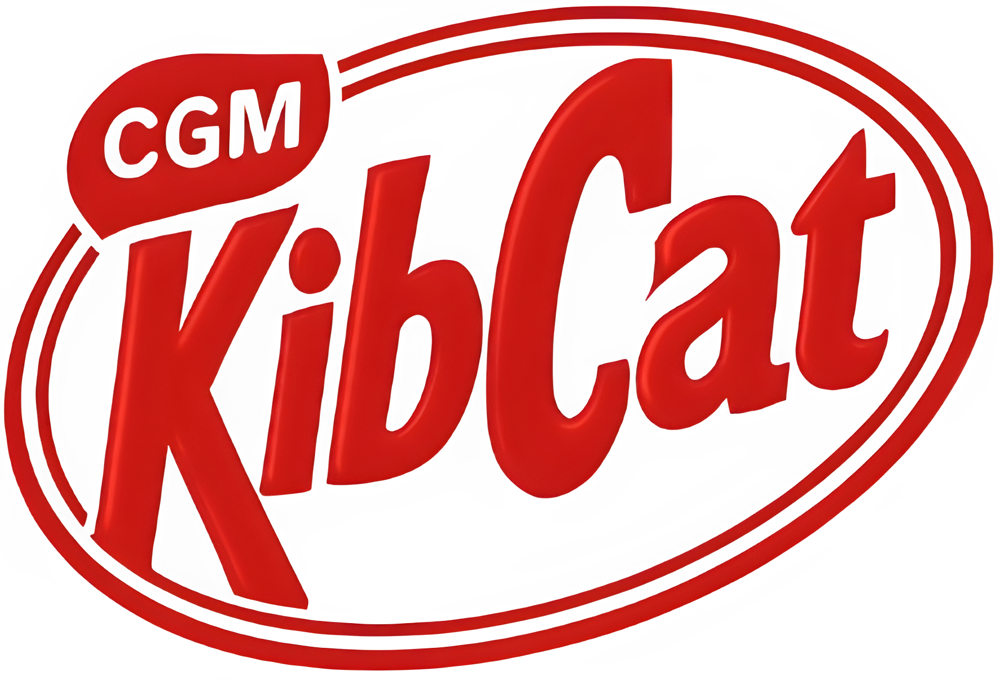

 

Kib-Cat, the best chocolate

---

Interrogazione database su elasticsearch tramite kibana, con filtraggio facilitato tramite LLM.

[Diario](https://github.com/shini161/kib-cat/blob/main/wiki/diary.md)
 
[Conclusioni](https://github.com/shini161/kib-cat/blob/main/wiki/conclusions.md)
